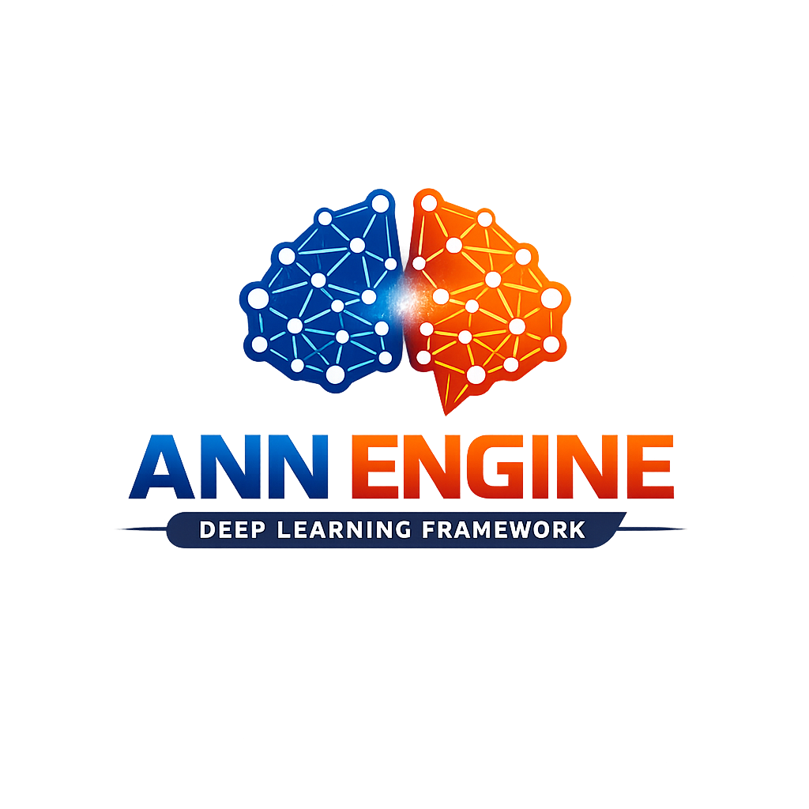

# ANN Engine – A Minimal Neural Network Training Framework from Scratch

<p align="center">
 
 </p>

## OverView
ANN Engine is a lightweight neural network training framework built from scratch using NumPy.

The objective of this project is to understand and implement the core mechanics of deep learning frameworks such as:
- Forward propagation
- Backpropagation
- Automatic gradient computation
- Optimization algorithms
- Modular layer design
- Training loop abstraction

This project focuses on clarity, modularity, and mathematical correctness rather than performance.

## Motivation
Modern deep learning frameworks abstract away gradient computation and optimization.

To deeply understand how neural networks train internally, this project re-implements:

- Linear layers
- Activation functions
- Loss functions
- Optimizers
- Backpropagation logic
- Model class with fit/predict interface

The goal is to bridge the gap between theory and production frameworks.

## Folder Structure

```python 
ann-engine/
│
├── README.md
├── pyproject.toml        
├── requirements.txt
│
├── ann_engine/             # Core library 
│   ├── __init__.py
│
│   ├── core/
│   │   ├── __init__.py
│   │   ├── parameter.py    # Trainable weights & gradients
│   │   └── tensor.py       
│
│   ├── layers/
│   │   ├── __init__.py
│   │   ├── base.py         # Layer abstract class
│   │   ├── dense.py
│   │   └── activations.py  # ReLU, Sigmoid, Softmax
│
│   ├── losses/
│   │   ├── __init__.py
│   │   ├── base.py
│   │   ├── mse.py
│   │   └── cross_entropy.py
│
│   ├── optimizers/
│   │   ├── __init__.py
│   │   ├── base.py
│   │   ├── sgd.py
│   │   └── adam.py
│
│   ├── engine/
│   │   ├── __init__.py
│   │   ├── model.py        # Sequential-like container
│   │   └── trainer.py      # Training loop
│
│   ├── utils/
│   │   ├── __init__.py
│   │   ├── initializers.py
│   │   ├── metrics.py
│   │   └── checks.py       # Gradient checking (later)
│
│   └── exceptions.py       # Custom framework errors
│
├── examples/
│   ├── binary_classification.py
│   ├── multiclass_classification.py
│   └── regression.py
│
├── tests/                 
    ├── test_dense.py
    ├── test_losses.py
    └── test_optimizers.py

```
## 1. Tensor (Design Approach)
### 1.1 Core Objective
The goal of the **Tensor** class in ANN ENGINE is to:
 - store numerial data
 - Track gradients
 - Build a dynamic computation graph
 - Enable reverse-mode automatic differentiation
This makes gradient-based optimization possible for neural networks.

### 1.2 Design Philosophy
I followed four core principles:
- 1. Dynamic Graph Construction
- 2. Reverse-mode Autodiff
- 3. Local Gradient Storage
- 4. Gradient Accumulation
The system is inspired by modern deep learning engines but implemented from scratch for educational clarity and control.

### 1.3  Step-by-step Approach
#### step1 Tensor as a Data + Gradient Container
Each **Tensor** stores:
- **data** -> NUmpy array (float32)
- **grad** -> same shape as data
- **_prev** -> Parent tensors (for graph tracking)
- **_op** -> Operation label
- **_backward** -> Local gradient function
This allows every tensor to act as a node in a computational graph.


